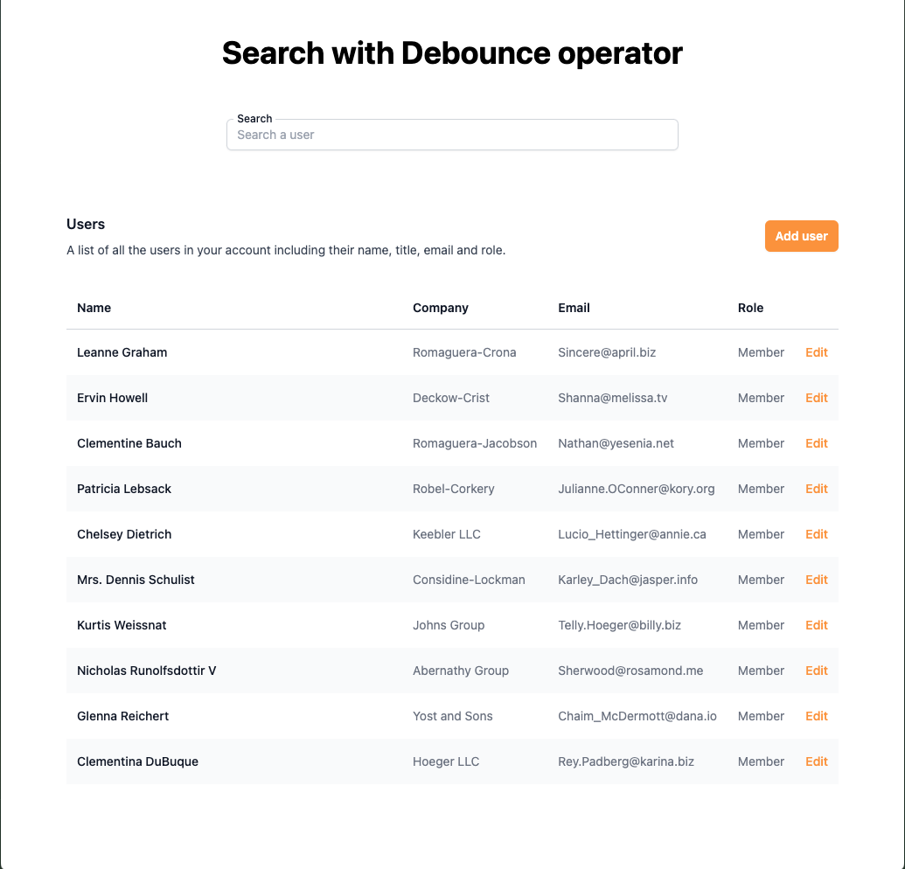

# Projet Barre de Recherche avec Debounce

Ce projet est une application Angular simple qui illustre l'implémentation d'une barre de recherche avec un mécanisme de `debounce`. La barre de recherche permet aux utilisateurs de rechercher des utilisateurs depuis une API distante et de filtrer les résultats en fonction de la saisie. Le projet utilise des composants standalone d'Angular et inclut des tests unitaires pour garantir le bon fonctionnement des fonctionnalités.



## Fonctionnalités

- **Recherche avec Debounce** : Empêche la fonction de recherche d'être appelée trop fréquemment en mettant en place un temps de debounce. Cela optimise les performances en réduisant le nombre de requêtes API.
- **Intégration API** : Récupère les données des utilisateurs depuis une API distante (JSONPlaceholder) et filtre les résultats localement.
- **Design Responsive** : La barre de recherche est conçue pour être responsive et facile à utiliser.
- **Tests Unitaires** : Inclut des tests unitaires pour le composant de recherche et le service, en utilisant les utilitaires de test d'Angular.

## Technologies Utilisées

- **Angular** : Framework utilisé pour construire l'application frontend.
- **RxJS** : Librairie utilisée pour gérer les flux de données asynchrones, incluant l'opérateur `debounce`.
- **API JSONPlaceholder** : API REST gratuite utilisée pour les tests et le prototypage.
- **Karma et Jasmine** : Framework de test et runner utilisés pour les tests unitaires.

## Démarrage

### Prérequis

- Node.js et npm installés sur votre système.
- Angular CLI installé globalement : `npm install -g @angular/cli`.

### Installation

1. Cloner le dépôt :
   ```bash
   git clone https://github.com/FlorianBx/angular-debounce-kata.git
   cd debounce-search-bar
   ```

2. Installer les dépendances :
   ```bash
   npm install
   ```

3. Lancer l'application :
   ```bash
   ng serve
   ```

4. Ouvrez votre navigateur et allez à l'adresse `http://localhost:4200`.

### Exécuter les Tests

Pour exécuter les tests unitaires, utilisez la commande suivante :

```bash
ng test
```

Cela exécutera les tests avec Karma et affichera les résultats dans la console.

## Structure du Projet

Voici un aperçu de la structure du projet :

```plaintext
src/
│
├── app/
│   ├── components/
│   │   └── searchbar/
│   │       ├── searchbar.component.ts
│   │       ├── searchbar.component.html
│   │       ├── searchbar.component.css
│   │       ├── searchbar.component.spec.ts
│   │
│   ├── services/
│   │   └── users.service.ts
│   │   └── users.service.spec.ts
│   │
│   └── app.component.ts
│   └── app.component.html
│   └── app.component.spec.ts
│
└── assets/
    └── screenshot.png
```
